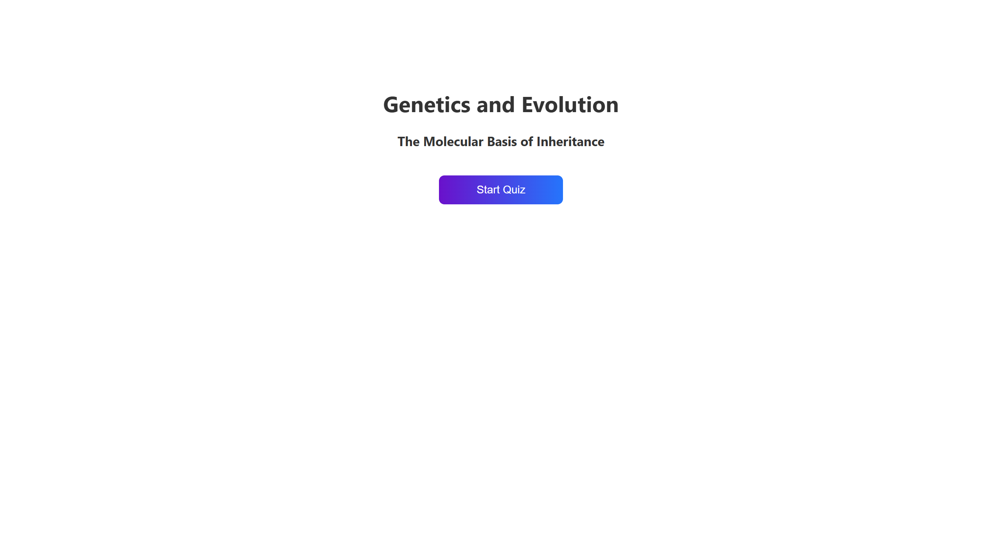
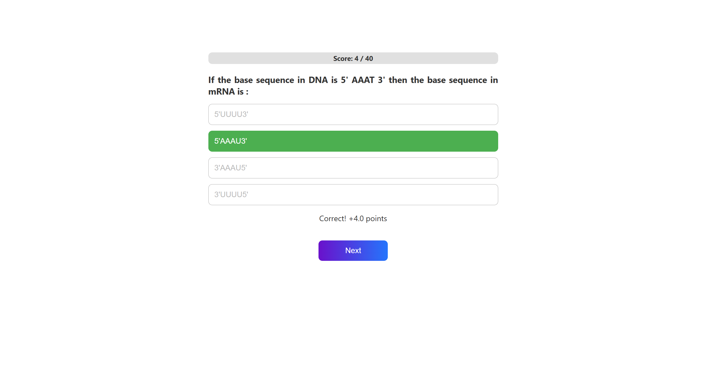
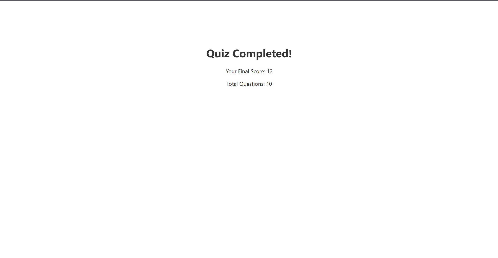

A single-page quiz application with gamification elements built using Vite + React.

Features ✨
🚀 Start quiz with dynamic data fetching

🎮 Interactive quiz flow with multiple-choice questions

💯 Real-time score tracking

📊 Results summary with performance metrics

🏆 Gamification elements (points system, instant feedback)

Screenshots 📸 

1. Start Screen
Start Screen
Welcomes users with quiz details and start button

  
2. Quiz in Progress
Quiz Screen
Interactive question display with answer options and progress indicator

 
3. Results Screen
Result Screen
Final score display with performance breakdown

Tech Stack 💻
⚡ Vite (Build Tool)

⚛️ React (JavaScript Library)

🎨 CSS Modules (Styling)

🔄 Fetch API (Data Integration)

Installation ⚙️
Clone repository:

bash
Copy
git clone https://github.com/ayushmeena1712/quizApp.git
Install dependencies:

bash
Copy
npm install
Start development server:

bash
Copy
npm run dev
Key Implementation Details 🔑
API Integration: Robust data fetching from https://api.jsonserve.com/Uw5CrX with error handling

Component Structure:

StartScreen.jsx: Handles quiz initialization

QuizFlow.jsx: Manages question flow and logic

ResultScreen.jsx: Displays final results

Gamification Features:

Instant answer feedback (✅/❌ indicators)

Progress bar visualization

Score accumulation system

Evaluation Criteria Coverage ✅
Criteria	Implementation Details
Data Integration	API fetch with error boundaries
UI/UX	Responsive design with smooth transitions
Gamification	Points system, visual feedback
Code Quality	Modular components, clean structure
Requirements Adherence	All core features implemented
To use this template: